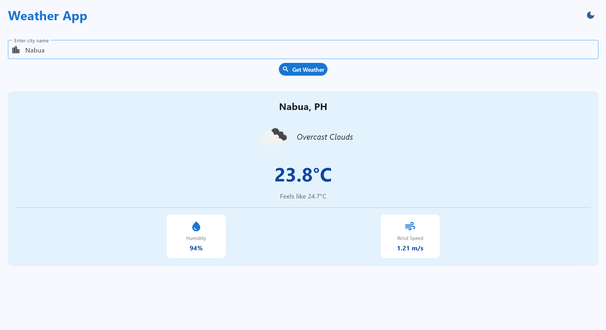
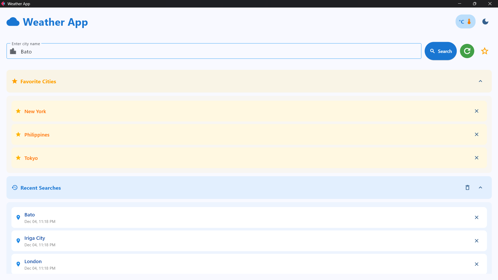
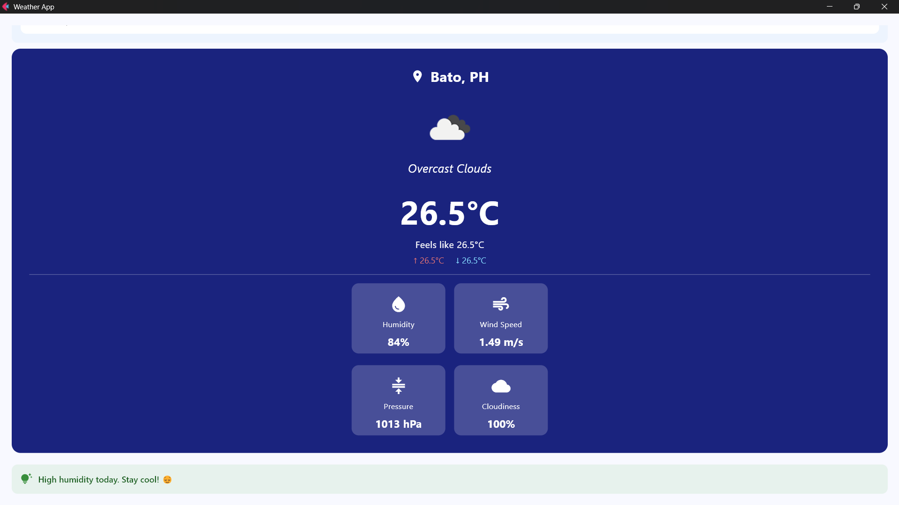
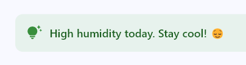

# Weather Application - Module 6 Lab

## Student Information
- **Name**: [Luis Van Dirk B. Albano]
- **Student ID**: [231002303]
- **Course**: CCCS 106
- **Section**: [BSCS 2-B]

## Project Overview
[The Weather App is a Python program developed with Flet and enables the user to access real time weather data by typing in a city name. It pulls live weather data of an online weather API and presents important information about the temperature, humidity, wind speed, and a weather condition icon. The application has a clean and easy to use interface, a light and dark theme switch, and it presents animated results to have a more visual experience. It also retains the recent searching history to enable one to access the previously searched places easily. All in all, the Weather App is a handy and easy method to review proper weather forecasts at any time.]

## Features Implemented

### Base Features
- [x] City search functionality
- [x] Current weather display
- [x] Temperature, humidity, wind speed
- [x] Weather icons
- [x] Error handling
- [x] Modern UI with Material Design

### Enhanced Features
1. **[Save Favorite Cities]**
   - Let the user “pin” or star a city to check quickly later.
   - I decided to use the Save Favorite Cities feature, as it would enable me to make a faster, more convenient, personal app, as the location of the most frequented locations is quickly available in the app.
   - The primary task was to store and recollect the list of the cities that the user has saved, and I managed to solve this problem by means of a simple data-saving technique that makes the list up-to-date and is loaded without any difficulties every time an app is launched.


2. **[Refresh Button]**
   - A button that re-fetches the latest weather.
   - Because its useful if users keep the app open for long.
   - Adding the refresh button was challenging because the app kept reloading and sometimes lagged. I solved this by refreshing only the weather data, using async functions, and adding error handling. This made the feature smooth and reliable.

3. **[Search History]**
   - The Search History feature keeps a list of previously searched locations, allowing users to quickly revisit cities without typing them again.
   - Search History was chosen to help users quickly revisit previous locations for faster and more convenient weather checks.
   - I faced data loading and UI issues, which I solved through debugging, testing, and optimizing my code.

4. **[Temperature Unit Toggle]**
   - The Temperature Unit Toggle allows users to switch between Celsius and Fahrenheit to view weather data in their preferred unit.
   - I chose this feature to give users flexibility and make the app more user-friendly by letting them view temperatures in their preferred unit.
   - I faced issues with accurate unit conversion and state updates, which I solved by implementing proper formulas and carefully managing the app’s state.

5. **[Weather Condition Icons and Colors]**
   - This feature displays matching icons and background colors for each weather condition, helping users instantly understand the weather at a glance.
   - I chose this feature because it makes the app more visual and user-friendly, allowing users to understand the weather instantly through clear icons and color cues.
   - The challenge was matching the right icons and colors to each weather condition, and I solved it by creating a simple mapping system that automatically updates the visuals based on the current weather data.

6. **[Daily Quote / Tip]**
   - This feature displays a short motivational quote or helpful weather-related tip each day to give users guidance or encouragement.
   - I chose this feature because it adds a personal and uplifting touch to the app, making the user experience more engaging and positive.
   - The challenge was updating the quote or tip consistently without disrupting the app, and I solved it by creating a simple rotation system that loads a new message automatically each day.

## Screenshots





## Installation

### Prerequisites
- Python 3.8 or higher
- pip package manager

### Setup Instructions
```bash
# Clone the repository
git clone https://github.com/<username>/cccs106-projects.git
cd cccs106-projects/mod6_labs

# Create virtual environment
python -m venv venv
source venv/bin/activate  # On Windows: venv\Scripts\activate

# Install dependencies
pip install -r requirements.txt

# Create .env file
cp .env.example .env
# Add your OpenWeatherMap API key to .env