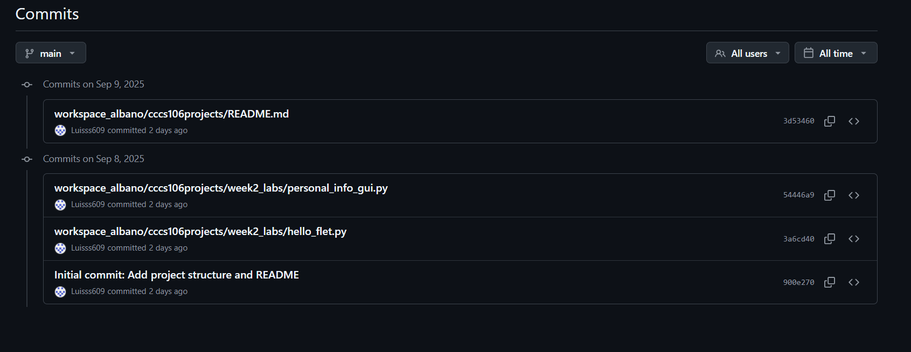

**Student Name:** Luis Van Dirk B. Albano
**Student ID:** 231002303
**Section:** B
**Date:** 9/11/2025

## Git Configuration

### Repository Setup
- **GitHub Repository:** [text](https://github.com/Luisss609/cccs106-projects)
- **Local Repository:** ✅ Initialized and connected
- **Commit History:** 51 commits with descriptive messages

### Git Skills Demonstrated
- ✅ Repository initialization and configuration
- ✅ Adding, committing, and pushing changes
- ✅ Branch creation and merging
- ✅ Remote repository management

## Flet GUI Applications

### 1. hello_flet.py
- **Status:** ✅ Completed
- **Features:** Interactive greeting, student info display, dialog boxes
- **UI Components:** Text, TextField, Buttons, Dialog, Containers
- **Notes:** The challenge was aligning the layout neatly, but using containers and rows made the design more organized.

### 2. personal_info_gui.py
- **Status:** ✅ Completed
- **Features:** Form inputs, dropdowns, radio buttons, profile generation
- **UI Components:** TextField, Dropdown, RadioGroup, Containers, Scrolling
- **Error Handling:** Input validation and user feedback
- **Notes:** The challenge was handling invalid inputs, which was solved by adding error dialogs and validation.

## Technical Skills Developed

### Git Version Control
- Understanding of repository concepts
- Basic Git workflow (add, commit, push)
- Branch management and merging
- Remote repository collaboration

### Flet GUI Development
- Flet 0.28.3 syntax and components
- Page configuration and layout management
- Event handling and user interaction
- Modern UI design principles

## Challenges and Solutions

Among the difficulties was the layout of the GUI to make it look clean and user friendly. To overcome this I would test different containers, rows and columns until I came up with the balanced design. The other challenge was the invalid input that was being injected into the personal info manager which I dealt with by incorporating error dialogs and validation. Git setup was also confusing initially, and through repeating commits and pushes, I was more assured about version control.

## Learning Outcomes

Having this lab, I got the experience of version control with the help of Git, as it became easier to monitor changes and control my work. I also learned to create the GUI using Flet, initially on how to create a simple greeting application, and then on how to make a more developed personal information manager with validation and user interaction. Finally, I learned the value of collaborative programming with the aid of Git and GitHub that allow organizing contributions and enhancing teamwork. Altogether, I understood that technical skills are necessary as well as a good organization in software development.

## Screenshots

### Git Repository
- [ ] GitHub repository with commit history

- [ ] Local git log showing commits

### GUI Applications
- [ ] hello_flet.py running with all features

- [ ] personal_info_gui.py with filled form and generated profile

## Future Enhancements
To be improved in the future, the applications might add a save or export option to enable the storage of generated profiles as text or PDF files. Personal information manager would be made more personal by adding an option of uploading a profile picture. Accessibility and user preference might also be enhanced by adding the light/dark theme switch. Besides, the validation of inputs could be increased by performing a requisite field check prior to submission. Finally, the calculator GUI can be extended to include more sophisticated or scientific functions to be more usable.